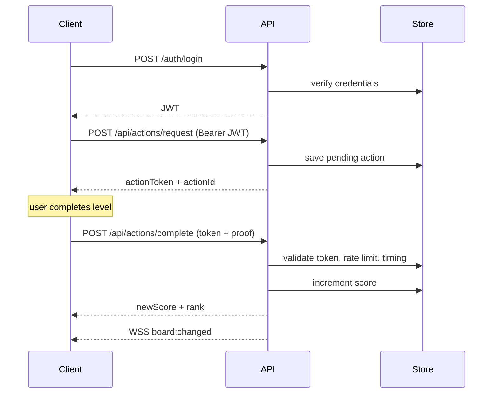

# Execution Flow

## Login and score update

## Anti-cheat checks (complete action)

1. JWT valid and matches token subject
2. Action token not expired or reused
3. Rate limit not exceeded
4. Completion time within allowed range
5. Score increment computed server-side
